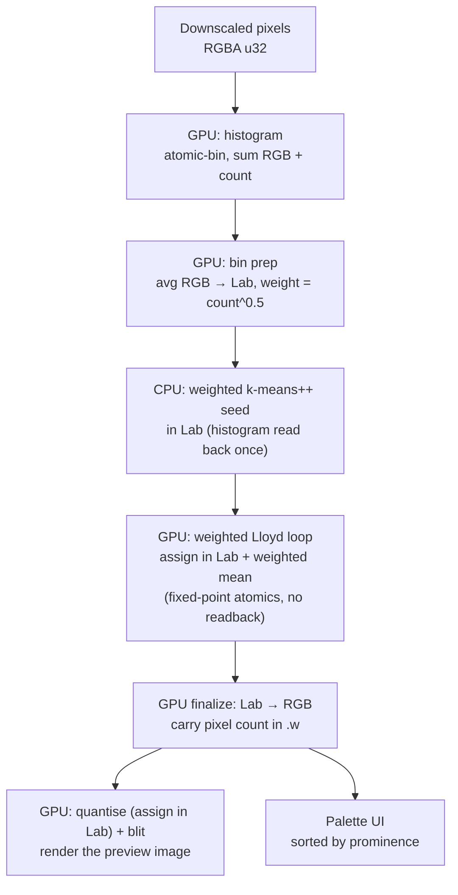

# Perceptual Palette Extraction

How the app pulls a palette that reflects the colours you actually *see* — including
small-but-vivid accents — instead of a wall of near-identical shades of the dominant hue.

> **TL;DR** — Plain k-means over pixels in RGB is biased toward big flat regions and
> uses a distance that doesn't match human vision. We fix both: cluster in **CIELAB**
> (perceptual distance) over a **colour histogram weighted by `√count`** (so a small
> region can still earn a swatch). The histogram, the weighted Lloyd loop, and the
> quantised preview all run on the **GPU**; only the sequential k-means++ seed is
> computed on the CPU.

---

## 1. Why plain k-means struggles

k-means minimises the **total** squared distance summed over *every pixel*:

```
J = Σ_pixels  ‖ pixel − nearest_centroid ‖²
```

Two consequences fall out of that objective, and both hurt palette quality:

### a) It's area-weighted → dominant colours hog the centroids
Every pixel gets one equal vote. If a colour covers 60% of the canvas (the yellow in
Klimt's *The Kiss*), it contributes the majority of `J`. The optimiser therefore gets
more error-reduction by dropping **several centroids inside the yellow cloud** (shaving
that huge aggregate variance) than by spending one on a tiny vivid-red patch that barely
moves the total. You end up with near-duplicate yellows and no red.

The bias is baked into the update step: a new centroid is the plain **mean** of its
pixels, so dense regions dominate.

### b) RGB distance isn't perceptual
`‖·‖²` in raw RGB doesn't match how different two colours *look*. Colours that are far
apart to the eye can be numerically close (and vice-versa), so "which colours are the
main ones" is skewed before clustering even starts, and true near-duplicate shades aren't
recognised as duplicates.

> Note: even good **k-means++** seeding (which spreads seeds by squared distance and often
> *does* catch the red initially) gets undone — Lloyd's area-weighted mean drags that
> centroid back toward the dense yellow/orange pixels it also captured. More iterations
> don't help; it's the objective, not convergence.

---

## 2. The two fixes

| Lever | What it changes | Which half it fixes |
|-------|-----------------|---------------------|
| **CIELAB space** | distance ≈ perceptual ΔE | near-duplicate shades collapse; distinct hues stay apart |
| **`√count` weighting** | vote per *distinct colour*, dampened by frequency | small accents stop being outvoted by area |

Formally, we swap the objective for a **weighted** one over unique colours `c` (bins):

```
J = Σ_bins  w_c · ‖ lab_c − nearest_centroid ‖²        with   w_c = count_c ^ p
```

- `p = 1` → same as area-proportional (old behaviour).
- `p = 0` → every distinct colour counts equally (max accents, ignores proportions).
- `p = 0.5` (√count) → the sweet spot we ship: dominant colours still lead, accents survive.

---

## 3. The pipeline

Passes tagged `GPU` are compute/render shaders; the seed is the one CPU step.



### Step 1 — Weighted colour histogram
We don't cluster 262 k pixels; we cluster the **distinct colours**. Each colour is quantised
to **5 bits per channel** (`value >> 3`), which merges near-identical colours and bounds the
bin count to ≤ 32 768. Every bin keeps the running sum of the real RGB values (so the bin's
representative colour is the *average* of the pixels that fell into it, not the bin centre)
and the pixel `count`.

```
key   = (r>>3)<<10 | (g>>3)<<5 | (b>>3)
weight = count ^ 0.5          // the de-weighting lever
```

### Step 2 — Move to CIELAB
Each bin's average RGB is converted to Lab **once**. From here on, all distances are plain
Euclidean in Lab — a good approximation of perceptual ΔE.

### Step 3 — Weighted k-means++ seeding
Spreads the initial centroids so Lloyd starts from a good configuration:

1. First centre: a bin chosen with probability ∝ `weight`.
2. Each subsequent centre: a bin chosen with probability ∝ `weight · D²`, where `D²` is the
   squared Lab distance to the **nearest already-chosen** centre.

Using `weight` (not raw pixel count) is what lets a small vivid bin get seeded.
A seeded PRNG (`mulberry32`) makes it deterministic: same image + `k` + seed → same palette.
The **Shuffle** button just advances the seed.

### Step 4 — Weighted Lloyd iterations (on the GPU)

Each iteration is two compute passes over the bins:

1. **Assign** (`bassign.wgsl`, one thread/bin) each bin to its nearest centre in Lab.
2. **Update** (`bfinalize.wgsl`, one thread/centre) each centre to the **weighted mean**
   of its bins:

   ```
   centre_c = ( Σ_{i∈c} w_i · lab_i ) / ( Σ_{i∈c} w_i )
   ```

3. **Empty cluster?** The finalize shader re-seeds it to a live bin so it gets another
   chance to capture colours.

WGSL atomics are integer-only, so the assign pass accumulates the fractional weighted
Lab sums in **fixed point**: multiply by a scale `S`, `atomicAdd` as `u32`, and let `S`
cancel in the finalize divide (`Σ(w·x·S) / Σ(w·S)`). `a`/`b` are biased by +128 to stay
non-negative. `S = 64` keeps the largest accumulator inside a `u32` well past the 512px
downscale cap (see the range note in `bassign.wgsl`).

The whole loop is encoded and submitted **once** — no per-iteration readback. That's the
point: early-stopping on centroid movement would force a GPU→CPU sync every iteration,
which at these sizes costs more than just running the fixed iteration budget. Over a few
thousand bins × `k` × ~30 iterations the loop is microseconds of GPU time.

### Step 5 — Back to RGB, then render

The finalize shader converts each Lab centroid back to RGB and writes `k*4` floats
`(r, g, b, count)` — the **raw pixel count lands in `.w`** so the palette can sort swatches
by real prominence. The quantise pass then renders the preview against that palette,
assigning each pixel to its nearest centroid **in Lab** (so the preview matches how the
palette was clustered). Both the centroid RGBs and the palette read back to the UI come
from the same buffer.

---

## 4. The math: sRGB ↔ CIELAB (D65)

Forward, `sRGB(0-255) → Lab`:

```
# 1. gamma-expand each channel to linear light
c_lin = c/255 ≤ 0.04045 ? (c/255)/12.92 : ((c/255 + 0.055)/1.055)^2.4

# 2. linear RGB → XYZ (D65 primaries)
X = rl·0.4124 + gl·0.3576 + bl·0.1805
Y = rl·0.2126 + gl·0.7152 + bl·0.0722
Z = rl·0.0193 + gl·0.1192 + bl·0.9505

# 3. normalise by white point, apply the Lab nonlinearity f()
f(t) = t > (216/24389) ? ∛t : ((24389/27)·t + 16)/116
L = 116·f(Y/Yn) − 16
a = 500·(f(X/Xn) − f(Y/Yn))
b = 200·(f(Y/Yn) − f(Z/Zn))
      with (Xn,Yn,Zn) = (0.95047, 1.0, 1.08883)
```

The inverse (`Lab → sRGB`) runs the same steps backwards. The implementation is verified to
round-trip **exactly** (0/255 error) on primaries and sample colours.

---

## 5. Tuning knobs

| Knob | Where | Effect |
|------|-------|--------|
| Weight exponent | `sqrt(count)` in `binprep.wgsl` + `seedFromHistogram` | Ships at `0.5`. Lower (→ `count^0` = 1) → more accents, less proportional; higher (→ `count^1`) → back toward area-proportional. Change both spots to keep seed and loop in sync. |
| Histogram bits | `histogram.wgsl` / `binprep.wgsl` (`>> 3`) | 5 bits merges more (fewer bins, smoother); 6 bits (`>> 2`) keeps finer distinctions (and raises `NUM_BINS`). |
| `k`, max iterations | UI sliders | number of palette colours / clustering budget (no early stop — the budget runs in full). |
| Fixed-point scale `S` | `bassign.wgsl` | precision vs. `u32` headroom for the weighted accumulators; see the range note there before raising the downscale cap. |

---

## 6. Trade-offs & limitations

- **Less proportional by design.** With `√count`, a 2%-of-the-image red can get a full
  swatch. That's usually what you want from a *palette*, but pushed too far (`p → 0`) it can
  surface rare/noisy specks. `0.5` is the guardrail.
- **No early stopping.** The Lloyd loop runs the full iteration budget rather than checking
  convergence, because an early-stop test would need a centroid readback every iteration —
  a GPU→CPU sync that, at these sizes, costs more than the extra iterations. The clustering
  is microseconds either way.
- **Fixed-point accumulation has a ceiling.** The weighted Lab sums are accumulated as
  `u32` (WGSL has no float atomics). With `NUM_BINS = 2¹⁵` and `S = 64` that's safe to about
  1M pixels; the 512px downscale cap keeps us well under it. Lifting the cap far past that
  means lowering `S` or moving to 64-bit accumulation.
- **Approximate weighting on the GPU.** Because the sums are truncated to fixed point, the
  weighted mean is exact only up to `1/S` — far finer than the palette needs, but not the
  bit-exact CPU float result.

---

## 7. Code map

| Concern | File |
|---------|------|
| sRGB ↔ Lab conversion (CPU, for seeding) | `src/color.ts` |
| sRGB ↔ Lab conversion (GPU, shared) | `src/shaders/lab.wgsl` |
| Pipeline + GPU loop orchestration | `PaletteFinder` in `src/palette-finder.ts` |
| CPU weighted k-means++ seed | `seedFromHistogram` in `src/palette-finder.ts` |
| GPU histogram → bin prep | `src/shaders/histogram.wgsl`, `binprep.wgsl` |
| GPU weighted Lloyd loop | `src/shaders/bassign.wgsl`, `bfinalize.wgsl` |
| GPU quantise (assign in Lab) / blit | `src/shaders/quantize.wgsl`, `blit.wgsl` |
| UI wiring | `src/main.ts` |
