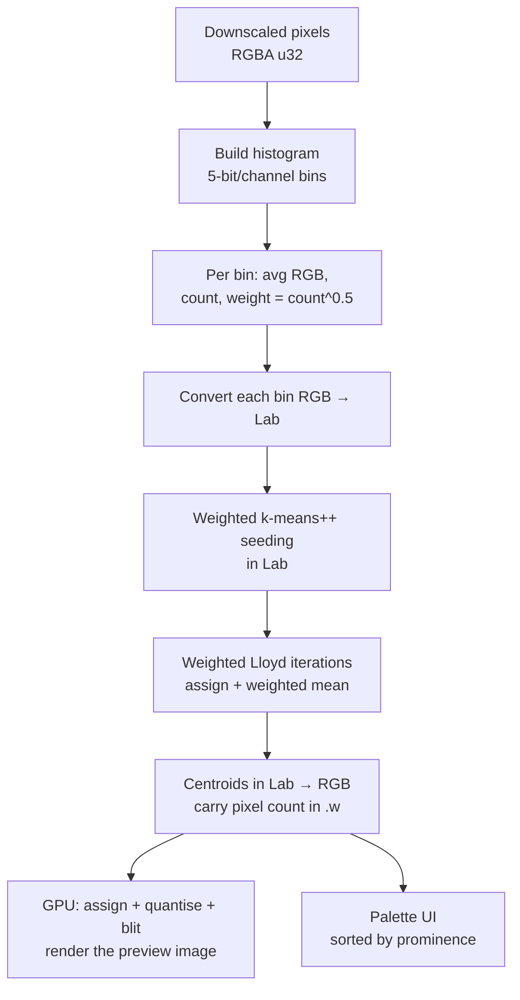

# Perceptual Palette Extraction

How the app pulls a palette that reflects the colours you actually *see* — including
small-but-vivid accents — instead of a wall of near-identical shades of the dominant hue.

> **TL;DR** — Plain k-means over pixels in RGB is biased toward big flat regions and
> uses a distance that doesn't match human vision. We fix both: cluster in **CIELAB**
> (perceptual distance) over a **colour histogram weighted by `√count`** (so a small
> region can still earn a swatch). The clustering runs on the CPU over a tiny
> histogram; the GPU still renders the quantised image.

---

## 1. Why plain k-means struggles

k-means minimises the **total** squared distance summed over *every pixel*:

```
J = Σ_pixels  ‖ pixel − nearest_centroid ‖²
```

Two consequences fall out of that objective, and both hurt palette quality:

### a) It's area-weighted → dominant colours hog the centroids
Every pixel gets one equal vote. If a colour covers 60% of the canvas (the yellow in
Klimt's *The Kiss*), it contributes the majority of `J`. The optimiser therefore gets
more error-reduction by dropping **several centroids inside the yellow cloud** (shaving
that huge aggregate variance) than by spending one on a tiny vivid-red patch that barely
moves the total. You end up with near-duplicate yellows and no red.

The bias is baked into the update step: a new centroid is the plain **mean** of its
pixels, so dense regions dominate.

### b) RGB distance isn't perceptual
`‖·‖²` in raw RGB doesn't match how different two colours *look*. Colours that are far
apart to the eye can be numerically close (and vice-versa), so "which colours are the
main ones" is skewed before clustering even starts, and true near-duplicate shades aren't
recognised as duplicates.

> Note: even good **k-means++** seeding (which spreads seeds by squared distance and often
> *does* catch the red initially) gets undone — Lloyd's area-weighted mean drags that
> centroid back toward the dense yellow/orange pixels it also captured. More iterations
> don't help; it's the objective, not convergence.

---

## 2. The two fixes

| Lever | What it changes | Which half it fixes |
|-------|-----------------|---------------------|
| **CIELAB space** | distance ≈ perceptual ΔE | near-duplicate shades collapse; distinct hues stay apart |
| **`√count` weighting** | vote per *distinct colour*, dampened by frequency | small accents stop being outvoted by area |

Formally, we swap the objective for a **weighted** one over unique colours `c` (bins):

```
J = Σ_bins  w_c · ‖ lab_c − nearest_centroid ‖²        with   w_c = count_c ^ p
```

- `p = 1` → same as area-proportional (old behaviour).
- `p = 0` → every distinct colour counts equally (max accents, ignores proportions).
- `p = 0.5` (√count) → the sweet spot we ship: dominant colours still lead, accents survive.

---

## 3. The pipeline



### Step 1 — Weighted colour histogram
We don't cluster 262 k pixels; we cluster the **distinct colours**. Each colour is quantised
to **5 bits per channel** (`value >> 3`), which merges near-identical colours and bounds the
bin count to ≤ 32 768. Every bin keeps the running sum of the real RGB values (so the bin's
representative colour is the *average* of the pixels that fell into it, not the bin centre)
and the pixel `count`.

```
key   = (r>>3)<<10 | (g>>3)<<5 | (b>>3)
weight = count ^ 0.5          // the de-weighting lever
```

### Step 2 — Move to CIELAB
Each bin's average RGB is converted to Lab **once**. From here on, all distances are plain
Euclidean in Lab — a good approximation of perceptual ΔE.

### Step 3 — Weighted k-means++ seeding
Spreads the initial centroids so Lloyd starts from a good configuration:

1. First centre: a bin chosen with probability ∝ `weight`.
2. Each subsequent centre: a bin chosen with probability ∝ `weight · D²`, where `D²` is the
   squared Lab distance to the **nearest already-chosen** centre.

Using `weight` (not raw pixel count) is what lets a small vivid bin get seeded.
A seeded PRNG (`mulberry32`) makes it deterministic: same image + `k` + seed → same palette.
The **Shuffle** button just advances the seed.

### Step 4 — Weighted Lloyd iterations
Repeat until convergence (or the iteration budget):

1. **Assign** each bin to its nearest centre in Lab.
2. **Update** each centre to the **weighted mean** of its bins:

   ```
   centre_c = ( Σ_{i∈c} w_i · lab_i ) / ( Σ_{i∈c} w_i )
   ```

3. **Empty cluster?** Re-seed it to a random weighted bin so it gets another chance to
   capture colours (mirrors the GPU shader's behaviour).
4. **Converge** when the largest centre movement is `< 0.5` Lab units (sub-perceptual).

Because it runs over a few thousand bins × `k` × ~30 iterations, this is a handful of
milliseconds on the CPU — no GPU needed for the clustering itself.

### Step 5 — Back to RGB, then render
Each Lab centroid is converted back to RGB and packed as `k*4` floats `(r, g, b, count)` —
the **raw pixel count lands in `.w`** so the palette can still sort swatches by real
prominence. That array has the exact same shape the GPU path produced, so the GPU renders
the quantised preview straight from it with **no Lloyd loop** (`maxIterations: 0` → just the
final assign → quantise → blit).

---

## 4. The math: sRGB ↔ CIELAB (D65)

Forward, `sRGB(0-255) → Lab`:

```
# 1. gamma-expand each channel to linear light
c_lin = c/255 ≤ 0.04045 ? (c/255)/12.92 : ((c/255 + 0.055)/1.055)^2.4

# 2. linear RGB → XYZ (D65 primaries)
X = rl·0.4124 + gl·0.3576 + bl·0.1805
Y = rl·0.2126 + gl·0.7152 + bl·0.0722
Z = rl·0.0193 + gl·0.1192 + bl·0.9505

# 3. normalise by white point, apply the Lab nonlinearity f()
f(t) = t > (216/24389) ? ∛t : ((24389/27)·t + 16)/116
L = 116·f(Y/Yn) − 16
a = 500·(f(X/Xn) − f(Y/Yn))
b = 200·(f(Y/Yn) − f(Z/Zn))
      with (Xn,Yn,Zn) = (0.95047, 1.0, 1.08883)
```

The inverse (`Lab → sRGB`) runs the same steps backwards. The implementation is verified to
round-trip **exactly** (0/255 error) on primaries and sample colours.

---

## 5. Tuning knobs

| Knob | Where | Effect |
|------|-------|--------|
| `WEIGHT_EXP` | `src/palette-finder.ts` | `0.5` ships. Lower (`0.35`, `0`) → more accents, less proportional. Higher (`0.7`, `1`) → back toward area-proportional. |
| Histogram bits | `buildHistogram` (`>> 3`) | 5 bits merges more (fewer bins, smoother); 6 bits (`>> 2`) keeps finer distinctions. |
| `k`, max iterations | UI sliders | number of palette colours / clustering budget. |
| Convergence ε | Lloyd loop (`< 0.5`) | smaller = tighter centroids, more iterations. |
| `PERCEPTUAL` | `src/main.ts` | `false` reverts to the original all-GPU RGB k-means. |

---

## 6. Trade-offs & limitations

- **Less proportional by design.** With `√count`, a 2%-of-the-image red can get a full
  swatch. That's usually what you want from a *palette*, but pushed too far (`p → 0`) it can
  surface rare/noisy specks. `0.5` is the guardrail.
- **Clustering moved to the CPU.** It's faster here (tiny histogram) and far easier to tune,
  but the *iterative* part no longer runs on the GPU. The GPU still does the per-pixel
  quantise + render of the preview.
- **Preview assignment is RGB.** The quantised image assigns pixels to the perceptual
  centroids using the unchanged RGB `assign` shader. The **palette** is fully perceptual;
  the preview is visually fine but not strictly perceptual. Making it perceptual means adding
  the Lab conversion inside the shader — a small follow-up.

---

## 7. Code map

| Concern | File |
|---------|------|
| sRGB ↔ Lab conversion | `src/color.ts` |
| Histogram + weighted Lab k-means | `findPalettePerceptual` in `src/palette-finder.ts` |
| Original all-GPU RGB k-means | `PaletteFinder` + `kmeansPlusPlusInit` in `src/palette-finder.ts` |
| Mode toggle + wiring | `PERCEPTUAL` in `src/main.ts` |
| GPU assign / finalize / quantise / blit | `src/shaders/*.wgsl` |
